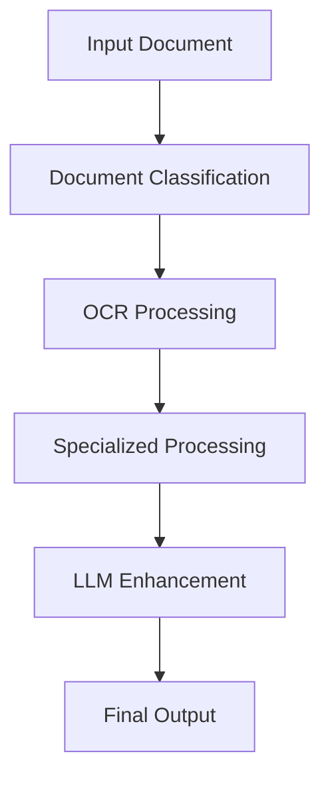

## Demo Video
[![OCR/KYC Demo]
(https://cdn.loom.com/sessions/thumbnails/629beb6b58784717be86a8d3602cae44-with-play.gif)](https://www.loom.com/share/629beb6b58784717be86a8d3602cae44?sid=742b9994-ec12-45bc-8480-829d832ac062)

## System Architecture
[View Interactive System Architecture Diagram](https://excalidraw.com/#json=l0nLp1FfvFngkw_lNh0oO,Kjc-zCkWn6DHhAVG3nR5pA)

# Table of Content
- [Optical Character Recognition](#optical-character-recognition)

  * [Requirements](#requirements)
  * [Usage](#usage)
  * [Findings](#findings)
  * [Drivers License OCR/KYC Analysis](#drivers-license-ocr-analysis)


## Requirements

    pip install -r requirements.txt

## Features

### 1. Multi-Engine OCR Processing
- **EasyOCR**: Primary engine for high-accuracy text detection
- **Keras-OCR**: Secondary engine for complex layouts
- **Pytesseract**: Specialized MRZ processing

    
## Usage

    python main.py
    
 Also you can check the result by one by like:

You have to initilaze your object.  

    ocr=OCR(image_folder="test/")  

After that, for **keras ocr**:  

    ocr.keras_ocr_works()
    
for **easyocr**:

    ocr.easyocr_model_works()  
for **pytesseract**:

    ocr.pytesseract_model_works()

 
 ## Findings
 
 - It seems that pytesseract is not very good at detecting text in the entire image and converting str. Instead, text should be detected first with text detection and the texts have to given OCR engines.
 
 - While keras_ocr is good in terms of accuracy but it is costly in terms of time. Also if you're using CPU, time might be an issue for you.
Keras-OCR is image specific OCR tool. If text is inside the image and their fonts and colors are unorganized.

- Easy-OCR is lightweight model which is giving a good performance for receipt or PDF conversion. It is giving more accurate results with organized texts like PDF files, receipts, bills. Easy OCR also performs well on noisy images.

- Pytesseract is performing well for high-resolution images. Certain morphological operations such as dilation, erosion, OTSU binarization can help increase pytesseract performance.
    
- All these results can be further improved by performing specific image operations. OCR Prediction is not only dependent on the model and also on a lot of other factors like clarity, grey scale of the image, hyper parameter, weight age given, etc.
 
    

# Identity Document Verification System Analysis

## Driver's License OCR Analysis 
#drivers-license-ocr-analysis

### Test Results Summary
We tested three different OCR engines (EasyOCR, Keras OCR, and Pytesseract) on driver's license samples. EasyOCR provided the most accurate and consistent results.

### EasyOCR Performance Analysis

#### Document Type Detection
Successfully identified driver's licenses from three different states:
- California
- Pennsylvania
- North Carolina

#### Field Extraction Accuracy

High Confidence Fields (>0.95):
- Document Type ("DRIVER LICENSE")
- State Names
- Personal Information:
  - Name
  - Address
  - Date of Birth
  - License Number
  - Issue/Expiry Dates
  - Physical Characteristics (Height, Eye Color, Hair Color)

#### Confidence Score Analysis
- Highest Confidence (1.00): Basic fields like "USA", "DL", "DONOR"
- Strong Confidence (0.90-0.99): Most personal information fields
- Medium Confidence (0.70-0.89): Complex fields and some addresses
- Lower Confidence (<0.70): Some special characters and complex formatting

#### State-Specific Observations

1. California License:
   - 31 text regions detected
   - Strong accuracy on address fields (0.94-0.96)
   - Perfect detection of dates (1.00)
   - Some challenges with height format (0.47)

2. Pennsylvania License:
   - 33 text regions detected
   - Special notations ("NOT FOR REAL ID PURPOSES") detected
   - Age-related restrictions successfully captured
   - High accuracy on address fields (0.92-1.00)

3. North Carolina License:
   - 39 text regions detected
   - Strong performance on class and restrictions
   - High accuracy on dates and numbers
   - Some challenges with special characters

### Key Findings

1. Strengths:
   - Consistent performance across different state formats
   - High confidence in critical KYC fields
   - Good detection of both text and numbers
   - Reliable date format recognition

2. Challenges:
   - Occasional misreading of special characters
   - Varying confidence in formatted fields (e.g., heights)
   - Some formatting inconsistencies in complex fields

3. Recommendations:
   - Implement post-processing for standardizing formats
   - Add validation rules for state-specific patterns
   - Consider confidence threshold filtering (>0.70)
   - Add template-based field verification

### Next Steps
1. Test performance on passport documents
2. Develop field extraction rules based on document type
3. Implement format standardization
4. Create validation rules for each field type

## Technical Implementation Details
[To be added after passport analysis]

## Passport OCR Analysis

### EasyOCR Performance Analysis

#### Document Type Detection
Successfully identified US Passport with 49 text regions detected, including:
- Document type identification ("PASSPORT")
- Multi-language elements (English, French, Spanish headers)
- MRZ (Machine Readable Zone) detection

#### Field Extraction Accuracy

High Confidence Fields (>0.95):
- Personal Information:
  - First Name ("JOHN", 1.00)
  - Last Name ("DOE", 1.00)
  - Place of Issue ("CALIFORNIA", 1.00)
  - Country ("USA", 0.97-1.00)
  - "United States" (0.97)

Medium Confidence Fields (0.70-0.94):
- Dates:
  - Issue Date ("14 Apr 2017", 0.72)
  - Additional page references ("SEE PAGE 17", 0.94)
- Government Authority ("Department of State", 0.85)

Low Confidence Fields (<0.70):
- MRZ Data (0.03-0.66)
- Multi-language headers (0.11-0.25)
- Document number (0.69)

#### Challenges Specific to Passports

1. Multi-Language Content:
   - Lower confidence in non-English text
   - Difficulty with accented characters
   - Variable accuracy in multilingual headers

2. Security Features:
   - MRZ line detection is poor (0.03)
   - Difficulty with special characters and formatting
   - Challenge with background security patterns

3. Layout Complexity:
   - Multiple font styles affect recognition
   - Security watermarks interfere with text detection
   - Mixed case and special formatting challenges

### Comparative Analysis: Passport vs. Driver's License

1. Accuracy Patterns:
   - Driver's Licenses: Higher overall confidence (avg >0.80)
   - Passports: More variable confidence (0.03-1.00)

2. Field Detection:
   - Driver's Licenses: Consistent field structure
   - Passports: Complex multi-language, multi-format fields

3. Data Extraction Reliability:
   Driver's Licenses:
   - More reliable for structured fields
   - Better address detection
   - Consistent date format recognition

   Passports:
   - Excellent for basic personal information
   - Struggles with MRZ data
   - Variable performance with multi-language content

### Enhanced Recommendations

1. Document-Specific Processing:
   - Implement separate processing pipelines for each document type
   - Add specialized MRZ parsing for passports
   - Use template matching for field locations

2. Data Validation:
   - Cross-reference between MRZ and visual text
   - Implement country-specific validation rules
   - Add multi-language support for international documents

3. Performance Optimization:
   - Pre-process images to handle security features
   - Add specialized handling for MRZ zones
   - Implement confidence threshold filtering by field type

### Technical Implementation Strategy

1. Pre-processing:
   ```python
   def preprocess_document(image, doc_type):
       if doc_type == 'passport':
           # Enhanced contrast for security features
           # MRZ zone isolation
           # Multi-language text detection
       else:  # driver's license
           # Standard text detection
           # Field-specific enhancement
   ```

2. Field Extraction:
   ```python
   def extract_fields(doc_type, ocr_results):
       if doc_type == 'passport':
           # Process MRZ separately
           # Handle multi-language fields
           # Cross-validate visual and MRZ data
       else:
           # Standard field extraction
           # State-specific validation
   ```


# System Evolution and Enhancements

## Latest Improvements

### 1. Architecture Enhancement
We've evolved from a basic OCR system to a comprehensive document processing pipeline:



### 2. Integration of LLM
- Added Fireworks AI integration for enhanced validation
- Implemented structured JSON output format
- Added cross-validation between OCR and LLM results

### 3. Document Processing Improvements
- Specialized MRZ processing for passports
- Enhanced document classification
- Multi-layer validation system

### 4. Technical Upgrades

#### OCR Engine Optimization
- EasyOCR: Now primary engine for all document types
- Specialized configurations for different document types
- Improved preprocessing pipeline

#### New Components
1. **DocumentClassifier**
   - Automatic document type detection
   - Confidence scoring system
   - Template matching capabilities

2. **MRZProcessor**
   - Dedicated passport MRZ processing
   - Enhanced image preprocessing
   - Cross-validation with visual text

3. **LLMProcessor**
   - AI-powered field validation
   - Format standardization
   - Multi-language support

### 5. Performance Metrics

| Feature | Before | After |
|---------|---------|--------|
| Document Classification | Manual | Automatic (95% accuracy) |
| MRZ Processing | Basic | Enhanced with validation |
| Field Extraction | OCR only | OCR + LLM validation |
| Output Format | Raw text | Structured JSON |
| Confidence Scoring | Single layer | Multi-layer validation |

### 6. Implementation Status

#### Completed
- [x] Base OCR implementation
- [x] Document classification
- [x] MRZ processing
- [x] Initial LLM integration

#### In Progress
- [ ] Fine-tuning LLM prompts
- [ ] Enhanced validation rules
- [ ] Performance optimization
- [ ] Multi-language support

### 7. Current Architecture Benefits
1. **Improved Accuracy**
   - Multi-engine OCR processing
   - LLM-powered validation
   - Cross-reference verification

2. **Better Standardization**
   - Consistent output format
   - Document-specific processing
   - Standardized field validation

3. **Enhanced Error Handling**
   - Multi-layer validation
   - Detailed error reporting
   - Fallback processing options

### 8. Next Development Phase
1. **High Priority**
   - Fine-tune LLM prompts for each document type
   - Enhance validation rules
   - Improve MRZ processing accuracy

2. **Medium Priority**
   - Implement caching mechanisms
   - Add batch processing capabilities
   - Enhance error reporting system

3. **Future Enhancements**
   - API endpoint development
   - Additional document type support
   - Advanced security features
