# Document Processing Demo: Traditional OCR vs Document Inlining
## Banking Institution Loan Processing Solution

---

## Agenda

1. Recap of Your Document Challenges (5 min)
2. Current Architecture & Exploration (8 min)
3. Document Inlining Solution (10 min)
4. Live Demo with Your Documents (15 min)
5. Integration & Security Path (5 min)
6. Q&A and Next Steps (2 min)

---

## Your Current Document Processing Challenges

- **OCR Accuracy Issues**: 5-10% of fields missing or incorrect
- **Manual Verification Bottlenecks**: Loan officers reviewing documents, causing backlog
- **Processing Delays**: 1-2 day correction cycles with customers
- **Scaling Problems**: System slows down with increased volume
- **Limited AI Exploration**: Testing GPT-4 but facing structural preservation issues

*"Our team is primarily focused on loans, not technology. We need a solution that's easy to integrate but powerful enough to handle complex documents."*

---

## Current State Architecture

```mermaid
graph TB
    subgraph "Current Document Processing Architecture"
        direction TB
        
        subgraph "Document Intake"
            A1[("📄 Document<br>Management<br>System")]
            A2["📱 Scanned ID Cards<br>& Passports"]
            A3["💰 Bank Statements"]
            A4["📊 Pay Stubs"]
            A5["📋 Loan Applications"]
            A2 & A3 & A4 & A5 --> A1
        end

        subgraph "Traditional OCR Processing"
            B1["🔍 Traditional OCR Engine<br>(Tesseract/Similar)"]
            B2["❌ 5-10% Fields<br>Missing/Incorrect"]
            B3["❌ Not Optimized for<br>Dynamic Forms"]
            B4["❌ Structure Loss in<br>Complex Documents"]
            B1 --> B2 & B3 & B4
        end

        subgraph "Manual Review Process"
            C1["👤 Loan Officer<br>Manual Review"]
            C2["✏️ Manual Data Entry<br>Corrections"]
            C3["📩 Customer Follow-up<br>for Corrections"]
            C4["⏱️ 1-2 Day<br>Processing Delays"]
            C5["📚 Months of<br>Loan Backlog"]
            B2 & B3 & B4 --> C1 --> C2 --> C3 --> C4 --> C5
        end
    end

    classDef intake fill:#e6f2ff,stroke:#0066cc,stroke-width:2px
    classDef ocr fill:#fff0f0,stroke:#cc6666,stroke-width:2px
    classDef manual fill:#ffeeee,stroke:#cc6666,stroke-width:1px

    class A1,A2,A3,A4,A5 intake
    class B1,B2,B3,B4 ocr
    class C1,C2,C3,C4,C5 manual
```



*This is based on our understanding of your current process - please correct us if we've misunderstood any aspects*

---

## Your GPT-4 Exploration Efforts

```mermaid
graph TB
    subgraph "Current GPT-4 Testing Environment"
        direction TB
        
        subgraph "Document Processing (Sandbox)"
            A1[("📄 Document<br>Management<br>System")]
            A2["📱 Scanned Documents"]
            A3["🤖 GPT-4 Vision API<br>(OpenAI SDK)"]
            A1 --> A2 --> A3
        end

        subgraph "Technical Limitations"
            B1["❌ Structure Loss in<br>Complex Tables"]
            B2["❌ Limited Financial<br>Document Expertise"]
            B3["⚠️ Scaling Cost<br>Concerns"]
            B4["⚠️ Speed Issues<br>at Volume"]
            A3 --> B1 & B2 & B3 & B4
        end

        subgraph "Implementation Challenges"
            C1["👤 Team Focused on Loans<br>Not Technology"]
            C2["🔄 Sandbox Environment<br>Not Production-Ready"]
            C3["⚠️ Integration with<br>Existing Systems"]
            B1 & B2 & B3 & B4 --> C1 & C2 & C3
        end
    end

    classDef processing fill:#e6f2ff,stroke:#0066cc,stroke-width:2px
    classDef limitations fill:#fff0f0,stroke:#cc6666,stroke-width:2px
    classDef challenges fill:#ffeeee,stroke:#cc6666,stroke-width:1px

    class A1,A2,A3 processing
    class B1,B2,B3,B4 limitations
    class C1,C2,C3 challenges
```



*Your exploration of GPT-4 shows forward thinking, but the structural challenges remain*

---

## The Banking Document Processing Modality Gap

```mermaid
flowchart LR
    %% Banking Document Types
    subgraph "Your Banking Documents" 
        A1["📄 Loan Applications<br>& Dynamic Forms"] 
        A2["💳 ID Cards & Passports"]
        A3["💰 Bank Statements<br>with Transaction Tables"]
        A4["📊 Pay Stubs & W2s"]
    end

    %% Current Challenges
    M["❌ Modality Gap<br>5-10% Error Rate<br>Structure Loss"]
    
    %% Fireworks AI Solution
    subgraph "Document Inlining Solution"
        B["🌉 Document Inlining<br>Structure preservation"]
        C["🔍 Automated Processing<br>No manual verification"]
        D["📝 Financial Domain LLM<br>Banking document expertise"]
        
        B --> C --> D
    end

    %% Banking Business Results
    subgraph "Your Business Outcomes"
        E["⚡ 1-2 Days → Minutes<br>Processing Time"]
        F["🎯 >98% Extraction Accuracy<br>vs. Current 90-95%"]
        G["💰 90% Reduction in<br>Manual Review Costs"]
        H["📈 Eliminated Loan<br>Processing Backlog"]
    end
    
    %% Current Process vs Document Inlining
    A1 & A2 & A3 & A4 --> M
    M -.->|"Your Current<br>Process"| X["❌ Manual Review Required<br>1-2 Day Delays"]
    M -->|"Document<br>Inlining"| B
    D --> E & F & G & H

    classDef banking fill:#f5f5ff,stroke:#6666cc,stroke-width:2px
    classDef current fill:#fff0f0,stroke:#cc6666,stroke-width:2px,color:#cc0000
    classDef solution fill:#e6f2ff,stroke:#0066cc,stroke-width:2px,color:#003366
    classDef results fill:#f0fff0,stroke:#00aa00,stroke-width:2px,color:#006600
    classDef manual fill:#ffeeee,stroke:#cc6666,stroke-width:1px,color:#cc0000,stroke-dasharray: 5 5
    
    class A1,A2,A3,A4 banking
    class M current
    class B,C,D solution
    class E,F,G,H results
    class X manual
```



*Document Inlining bridges the gap between your complex banking documents and automated processing*

---

## Technical Architecture: How Document Inlining Works


*Document Inlining technology bridges the modality gap by preserving document structure through specialized transformation, enabling financial domain LLMs to process documents with their full reasoning capabilities intact, while maintaining appropriate human expertise through intelligent verification routing.*

---

## Document Inlining Architecture with Intelligent Human-in-the-Loop

```mermaid
graph TB
    subgraph "Document Inlining Architecture"
        direction TB
        
        subgraph "Document Intake"
            A1[("📄 Document<br>Management<br>System")]
            A2["📱 Scanned ID Cards<br>& Passports"]
            A3["💰 Bank Statements"]
            A4["📊 Pay Stubs"]
            A5["📋 Loan Applications"]
            A2 & A3 & A4 & A5 --> A1
        end

        subgraph "Document Inlining Processing"
            B1["🌉 Document Inlining<br>Engine"]
            B2["✅ Structure<br>Preservation"]
            B3["📊 Confidence<br>Scoring"]
            B4["⚙️ Risk & Complexity<br>Assessment"]
            A1 --> B1 --> B2 --> B3 --> B4
        end

        subgraph "Intelligent Routing"
            C1{"🔄 Decision<br>Engine"}
            B4 --> C1
            
            C2["🚦 High Confidence<br>>95% Score<br>Low Risk"]
            C3["⚠️ Medium Confidence<br>90-95% Score<br>Medium Risk"]
            C4["❓ Low Confidence<br><90% Score<br>High Risk"]
            
            C1 -->|"~80-90% of<br>Documents"| C2
            C1 -->|"~5-15% of<br>Documents"| C3
            C1 -->|"~5% of<br>Documents"| C4
        end
        
        subgraph "Tiered Processing"
            D1["✅ Straight-Through<br>Processing<br>(No Human Review)"]
            D2["👤 Targeted Review<br>(Specific Fields)"]
            D3["👥 Full Human<br>Review"]
            
            C2 --> D1
            C3 --> D2
            C4 --> D3
            
            D4["📊 Business Rules<br>Engine"]
            D5["⚖️ Regulatory<br>Requirements"]
            
            D1 & D2 & D3 --> D4 --> D5
        end
    end

    classDef intake fill:#e6f2ff,stroke:#0066cc,stroke-width:2px
    classDef inlining fill:#e0f8e0,stroke:#009900,stroke-width:2px
    classDef routing fill:#fff8e0,stroke:#cc9900,stroke-width:2px
    classDef processing fill:#f0f0ff,stroke:#9900cc,stroke-width:2px

    class A1,A2,A3,A4,A5 intake
    class B1,B2,B3,B4 inlining
    class C1,C2,C3,C4 routing
    class D1,D2,D3,D4,D5 processing
```



*Intelligent human-in-the-loop model focuses verification where it's most needed - by risk, confidence, and regulatory requirements*

---

## What is Compound AI? Simplified for Banking

Compound AI combines multiple AI capabilities to handle complex banking documents:

1. **Document Structure Analysis**: Preserves relationships in tables, forms, and multi-page documents

2. **Financial Domain Knowledge**: Specialized understanding of banking terminology and document types

3. **Validation & Cross-Checking**: Automatically verifies extracted information for accuracy

Think of it like having a team of specialized loan processors working together, but fully automated:
- One preserving document structure (tables, forms)
- One extracting the relevant banking information
- One validating the extracted data for accuracy

*No specialized technical knowledge required to implement — designed for loan processing teams*

---

## Processing Pipeline Comparison with Human-in-the-Loop

```mermaid
graph LR
    subgraph "Traditional OCR"
        direction TB
        A1["📄 Document"]
        A2["🔍 OCR Engine"]
        A3["📋 Extracted Text<br>No Structure"]
        A4["👤 Manual Review<br>100% of Documents"]
        A5["⏱️ Days to Process"]
        A1 --> A2 --> A3 --> A4 --> A5
    end
    
    subgraph "GPT-4 Vision"
        direction TB
        B1["📄 Document"]
        B2["🤖 Vision API"]
        B3["📋 Enhanced Text<br>Limited Structure"]
        B4["👤 Manual Verification<br>50-70% of Documents"]
        B5["⏱️ Variable Processing"]
        B1 --> B2 --> B3 --> B4 --> B5
    end
    
    subgraph "Document Inlining"
        direction TB
        C1["📄 Document"]
        C2["🌉 Inlining Engine"]
        C3["📋 Preserved Structure"]
        C4["📊 Confidence Scoring"]
        C5["👤 Smart Verification<br>Only 5-10% of Documents"]
        C6["⏱️ Minutes to Process"]
        C1 --> C2 --> C3 --> C4 --> C5 --> C6
    end

    classDef traditional fill:#fff0f0,stroke:#cc6666,stroke-width:2px
    classDef vision fill:#fff8e0,stroke:#cc9900,stroke-width:2px
    classDef inlining fill:#e0f8e0,stroke:#009900,stroke-width:2px

    class A1,A2,A3,A4,A5 traditional
    class B1,B2,B3,B4,B5 vision
    class C1,C2,C3,C4,C5,C6 inlining
```



*Document Inlining provides intelligent verification, focusing human expertise where it's truly needed*

---

## Three Approaches Compared

| Feature | Traditional OCR | GPT-4 Vision | Document Inlining |
|---------|----------------|--------------|-------------------|
| **Table Structure** | ❌ Lost | ⚠️ Partially Preserved | ✅ Fully Preserved |
| **Processing Time** | ⚠️ Minutes + Manual Days | ⚠️ Slow at Scale | ✅ Minutes End-to-End |
| **Dynamic Forms** | ❌ Not Optimized | ⚠️ Variable Results | ✅ Optimized Handling |
| **Accuracy** | ⚠️ 90-95% | ⚠️ Variable | ✅ >98% |
| **Human Verification** | ❌ 100% of Documents | ⚠️ 50-70% of Documents | ✅ 5-10% (Risk-Based) |
| **Cost at Scale** | ❌ High (Manual Labor) | ❌ Expensive API Calls | ✅ Optimized for Volume |
| **Integration** | ⚠️ Complex Pipeline | ⚠️ New SDK Required | ✅ Similar to OpenAI SDK |
| **Regulatory Compliance** | ⚠️ Variable | ⚠️ Limited Auditing | ✅ Full Tracking & Audit |
| **Team Expertise** | ⚠️ Moderate | ❌ High | ✅ Low (Loan-Focused) |

---

## Document Inlining Integration Architecture


*Seamless integration with your existing systems while maintaining appropriate human oversight*

---

## Implementation Benefits

| Metric | Current State | With Document Inlining | Impact |
|--------|--------------|------------------------|--------|
| **Document Processing Time** | 1-2 days | Minutes - Hours | 90% reduction |
| **Manual Review Required** | ~100% of documents | ~5-10% of documents | 90% reduction |
| **Document Error Rate** | 5-10% | <2% | 80% reduction |
| **Loan Officer Time Per File** | 20-30 minutes | 2-3 minutes | 90% time savings |
| **Correction Cycles** | 1-2 per document | <0.1 per document | 90% reduction |
| **Customer Wait Time** | Days | Hours | Improved satisfaction |
| **Processing Capacity** | Fixed by staff | Elastic with volume | Scalable operations |
| **Regulatory Compliance** | Manual tracking | Automated audit trails | Enhanced compliance |

---

## Human-in-the-Loop: Transformed Role

| Current Role | Transformed Role |
|--------------|------------------|
| Manual data extraction | Focus on decision-making |
| Routine verification | Exception handling only |
| Document classification | Strategic risk assessment |
| Error correction | Process improvement |
| Customer follow-up for errors | Higher-value customer service |

*Your team's expertise is directed to where it adds the most value, not routine tasks*

---

## Implementation Roadmap

### Phase 1: Pilot (4-6 Weeks)
- Select 1-2 document types (bank statements, loan applications)
- Define verification thresholds and routing rules
- Train verification team on new workflow
- Measure baseline vs. new process metrics

### Phase 2: Expansion (2-3 Months)
- Add remaining document types
- Refine confidence thresholds based on pilot results
- Integrate with downstream systems
- Optimize human verification workflow

### Phase 3: Full Implementation (3-4 Months)
- Complete integration with all banking systems
- Implement advanced analytics and monitoring
- Optimize verification criteria
- Scale to full production volume

*We'll partner with you through each phase, with clear success metrics*

---

## Live Demo: Bank Statement Processing

We'll process an actual bank statement using all three approaches:

1. **Traditional OCR approach**
   - Show the 5-10% error rate in action
   - Demonstrate table structure loss
   - Highlight manual verification requirements

2. **Current GPT-4 testing**
   - Show your current sandbox approach
   - Highlight structural preservation issues
   - Demonstrate scaling limitations
   
3. **Document Inlining approach**
   - Show complete table structure preservation
   - Demonstrate >98% accuracy with the same document
   - Highlight processing time difference

---

## Live Demo: Loan Application Processing

Watch as we process a loan application with dynamic form fields:


*Key metrics to watch: Processing time, accuracy rate, structure preservation*

---

## Scaling & Performance Architecture

```mermaid
graph TB
    subgraph "Scaling & Performance Architecture"
        direction TB
        
        subgraph "Current Scaling Challenges"
            A1["⏱️ System Slowdown<br>with Volume"]
            A2["💸 Cost Increases<br>with Scale"]
            A3["👤 Manual Process<br>Doesn't Scale"]
            A4["🔄 Processing Backlog<br>with Volume"]
        end

        subgraph "Document Inlining Scaling Solution"
            B1["⚡ Consistent Processing<br>Time at Scale"]
            B2["💰 Volume-Based<br>Pricing Model"]
            B3["🤖 Automated Document<br>Processing Pipeline"]
            B4["⚖️ Load Balancing &<br>Optimization"]
            A1 --> B1
            A2 --> B2
            A3 --> B3
            A4 --> B4
        end
    end

    classDef challenges fill:#fff0f0,stroke:#cc6666,stroke-width:2px
    classDef solutions fill:#e0f8e0,stroke:#009900,stroke-width:2px

    class A1,A2,A3,A4 challenges
    class B1,B2,B3,B4 solutions
```



*Addresses your specific concerns about system slowdown and cost increases at volume*

---

## Key Results Comparison

| Metric | Current Process | Document Inlining | Improvement |
|--------|----------------|-------------------|-------------|
| **Processing Time** | 1-2 days | 2-3 minutes | >99% reduction |
| **Accuracy** | 90-95% | >98% | 8% improvement |
| **Manual Review** | 90% of documents | <10% of documents | 80% reduction |
| **Backlog** | Months of delay | Same-day processing | Eliminates backlog |
| **Scalability** | Degrades with volume | Consistent performance | Handles peak periods |
| **Tech Expertise Required** | Moderate | Minimal | Loan-focus enabled |

---

## Technical Integration Architecture

```mermaid
graph TB
    subgraph "Technical Integration Architecture"
        direction TB
        
        subgraph "Current Tech Stack"
            A1[("📄 Document<br>Management")]
            A2["🔍 Traditional OCR"]
            A3["🧪 OpenAI SDK<br>Sandbox Testing"]
            A1 --> A2
            A1 --> A3
        end

        subgraph "Integration Steps"
            B1["🔌 One-Line Code Change<br>#transform=inline"]
            B2["🔄 Reuse Existing<br>Document Flow"]
            B3["🛡️ Security Layer<br>Implementation"]
            B4["📊 Confidence Threshold<br>Configuration"]
            A2 -.- B1
            A3 --> B1
            B1 --> B2 --> B3 --> B4
        end
    end

    classDef current fill:#e6f2ff,stroke:#0066cc,stroke-width:2px
    classDef integration fill:#e0f8e0,stroke:#009900,stroke-width:2px

    class A1,A2,A3 current
    class B1,B2,B3,B4 integration
```



*Designed for your team that's "primarily focused on loans, not technology"*

---

## Simple One-Line API Change

### Current OpenAI SDK Implementation:
```python
# Your current GPT-4 testing in sandbox
response = openai.ChatCompletion.create(
    model="gpt-4-vision",
    messages=[{
        "role": "user", 
        "content": [{"type": "image", "url": document_url}]
    }]
)
```

### Document Inlining Implementation:
```python
# Document Inlining approach
response = fireworks.ChatCompletion.create(
    model="llama-v3p3-70b-instruct",
    messages=[{
        "role": "user", 
        "content": [{"type": "image", "url": document_url + "#transform=inline"}]
    }]
)
# Just one parameter change transforms document processing
```

---

## Banking-Grade Security Architecture

```mermaid
graph TB
    subgraph "Security & Compliance Architecture"
        direction TB
        
        subgraph "Banking Regulatory Requirements"
            A1["🏦 Banking Industry<br>Compliance"]
            A2["🔒 Document Privacy<br>Standards"]
            A3["📜 Audit Requirements"]
            A4["⚖️ Data Governance"]
        end

        subgraph "Security Controls"
            B1["🔐 SOC 2 Type II<br>Compliance"]
            B2["📊 End-to-End<br>Encryption"]
            B3["🧹 No Document<br>Storage"]
            B4["🔍 Detailed Audit<br>Logging"]
            A1 & A2 & A3 & A4 --> B1 & B2 & B3 & B4
        end
    end

    classDef regulatory fill:#e6f2ff,stroke:#0066cc,stroke-width:2px
    classDef security fill:#e0f8e0,stroke:#009900,stroke-width:2px

    class A1,A2,A3,A4 regulatory
    class B1,B2,B3,B4 security
```



*All security measures meet or exceed banking industry standards*

---

## Implementation Roadmap: Banking-Friendly Timeline

### Phase 1: Pilot (4 weeks)
- Start with your highest-priority document types:
  - Bank statements (to solve table structure issues)
  - Loan applications (to solve dynamic form issues)
- Integrate with your existing document management system
- Measure accuracy against your current 90-95% baseline
- Calculate time savings from 1-2 days to minutes

### Phase 2: Production Rollout (4-6 weeks)
- Gradual migration from your sandbox environment
- No-code/minimal-code approach for your loan-focused team
- Performance monitoring during volume increases
- Full integration with your loan processing system

---

## Immediate Next Steps

1. **Technical Workshop** (Next Week)
   - Deep-dive with your sandbox testing team
   - API integration planning
   - Security compliance review

2. **Pilot Program Setup** (Week 2)
   - Define >90% accuracy success metric
   - Select initial document types (bank statements & loan forms)
   - Set up testing environment

3. **ROI Calculation** (Week 3)
   - Document current processing costs and backlogs
   - Project savings with automated processing
   - Establish KPIs for your loan processing metrics

---

## Thank You

### Contact Information
- Implementation Team: implementation@fireworks.ai
- Technical Support: support@fireworks.ai
- Documentation: docs.fireworks.ai

*Let's transform your document processing workflow together!* 


Understanding Document Inlining Technology
Based on the information provided, let me explore Document Inlining technology in more depth to help you better explain it during your discovery meeting.
Core Concept of Document Inlining
Document Inlining is a compound AI technology developed by Fireworks AI that solves a fundamental challenge in AI document processing: bridging the "modality gap" between document formats (images, PDFs) and language models. It works by:
Transforming Documents: Converting images and PDFs into formats that language models can process effectively
Preserving Structure: Maintaining the structural integrity of documents, including tables, charts, and layouts
Enabling Better Reasoning: Allowing specialized text-based language models to reason about document content
The Modality Gap Problem
The term "modality gap" refers to a key insight: vision models (VLMs) typically perform worse on reasoning tasks compared to text-only language models, even when working with identical information. This happens because:
Vision models are optimized for visual understanding but often have less sophisticated reasoning capabilities
Text models receive more extensive training for reasoning and instruction-following
Working across modalities (from visual to reasoning) creates inefficiencies in how information is processed
Technical Implementation
Document Inlining uses a two-step approach:
Parsing Phase:
Transcribes non-textual content using "complete OCR" technology
Detects and properly formats tables, charts, and other structured elements
Maintains document hierarchy and relationships between elements
Preserves the structural information that gives context to the content
Ingestion Phase:
Feeds the resulting structured text into a specialized language model
Enables reasoning and analysis using more powerful text-based models
Allows for using domain-specific or fine-tuned models that wouldn't otherwise handle images
Technical Integration
The implementation is remarkably simple:
Uses an OpenAI-compatible API for easier adoption
Requires just adding #transform=inline to the file reference in the API call
Example: "url": "https://storage.googleapis.com/fireworks-public/test/sample_resume.pdf#transform=inline"
Works with both images and multi-page PDFs
Proven Performance
In internal benchmarks comparing Document Inlining with standard vision models:
The approach outperformed GPT-4o on document processing tasks in 68% of tests
Tests were conducted on 100 article-question pairs from arXiv documents
Evaluation was done by Claude 3.5-Sonnet to ensure objectivity
Advantages for Loan Processing Applications
For financial services loan processing, Document Inlining offers specific advantages:
Complex Document Handling: Loan applications involve many document types with complex structures (W2s, bank statements, loan applications, etc.)
Accuracy Improvements: Better reasoning leads to more accurate extraction of critical financial data points
Table Processing: Financial documents often contain tables with critical numerical data (income statements, amortization schedules, etc.)
Cross-Document Verification: Can better understand relationships between information across multiple documents in a loan package
Specialized Models: Allows using financial domain-specific language models that wouldn't normally process images
Efficiency: Parallel processing of multi-page documents improves throughput for high-volume loan processing
How It's Different from Traditional Approaches
Traditional approaches typically involve:
Using OCR to extract text from documents
Creating multiple processing pipelines for different document types
Building custom extractors for tables and structured data
Manually stitching extracted information together
Document Inlining eliminates these complex steps by:
Handling the transformation automatically
Preserving document structure during transformation
Using the reasoning capabilities of text models to understand context
Requiring minimal code changes to implement
Visualization for Your Architecture Diagram
To make your Mermaid diagram more accurate, you might consider:
Adding a "Structure Preservation" component that shows how tables, charts, and hierarchies are maintained
Illustrating the parallel processing of multi-page documents
Showing how the technology enables specialized financial models to process document content
Depicting the comparison between traditional vision model processing and the Document Inlining approach

## Document Inlining + LLM Integration

```mermaid
graph TB
    subgraph "Document Inlining LLM Integration"
        direction TB
        
        subgraph "Document Input"
            A1["📄 Banking Documents"]
            A2["🔗 Document URL or File"]
        end
        
        subgraph "API Integration"
            B1["🔌 API Call with<br>#transform=inline"]
            B2["🔄 Document Structure<br>Transformation"]
            B3["📑 Format Preservation"]
            
            A1 & A2 --> B1 --> B2 --> B3
        end
        
        subgraph "LLM Processing"
            C1["🧠 Financial Domain LLM<br>(llama-v3p3-70b)"]
            C2["📊 Text-Based<br>Reasoning"]
            C3["🔍 Structure-Aware<br>Processing"]
            
            B3 --> C1 --> C2 --> C3
        end
        
        subgraph "Integration Methods"
            D1["📲 API-Direct Integration"]
            D2["💻 SDK for Python/JavaScript"]
            D3["♻️ OpenAI SDK Compatible"]
            D4["🔄 REST API Endpoints"]
            
            C3 --> D1 & D2 & D3 & D4
        end
    end
    
    classDef input fill:#e6f2ff,stroke:#0066cc,stroke-width:2px
    classDef api fill:#e0f8e0,stroke:#009900,stroke-width:2px
    classDef llm fill:#fff8e0,stroke:#cc9900,stroke-width:2px
    classDef methods fill:#f0f0ff,stroke:#9900cc,stroke-width:2px
    
    class A1,A2 input
    class B1,B2,B3 api
    class C1,C2,C3 llm
    class D1,D2,D3,D4 methods
```



### Simple Code Integration

```python
# BEFORE: Your current GPT-4 Vision implementation
response = openai.ChatCompletion.create(
    model="gpt-4-vision-preview",
    messages=[{
        "role": "user", 
        "content": [
            {"type": "text", "text": "Extract all fields from this loan application"},
            {"type": "image", "url": document_url}
        ]
    }]
)

# AFTER: Document Inlining implementation (minimal change)
response = fireworks.ChatCompletion.create(
    model="llama-v3p3-70b-instruct",
    messages=[{
        "role": "user", 
        "content": [
            {"type": "text", "text": "Extract all fields from this loan application"},
            {"type": "image", "url": document_url + "#transform=inline"}  # Just add parameter
        ]
    }]
)
```

*Simple to integrate, with minimal code changes to your existing workflows*

---

## Banking System Integration Architecture

```mermaid
graph TB
    subgraph "Your Banking Environment"
        direction TB
        
        subgraph "Document Sources"
            A1["📄 Document Management<br>System"]
            A2["📱 Client Portal<br>Uploads"]
            A3["📨 Email<br>Attachments"]
            A4["💻 Branch<br>Scans"]
        end
        
        subgraph "Fireworks AI Integration"
            B1["🔌 REST API<br>Connector"]
            B2["🌉 Document Inlining<br>Processing"]
            B3["🧠 Financial Domain<br>LLM"]
            B4["📊 Confidence Scoring<br>Engine"]
            
            A1 & A2 & A3 & A4 --> B1 --> B2 --> B3 --> B4
        end
        
        subgraph "Smart Verification Layer"
            C1{"🔍 Confidence<br>Router"}
            C2["✅ Auto-Approved<br>Documents"]
            C3["👤 Human Review<br>Queue"]
            
            B4 --> C1
            C1 -->|"High Confidence<br>(~90%)"| C2
            C1 -->|"Needs Review<br>(~10%)"| C3
        end
        
        subgraph "Banking Systems Integration"
            D1["📝 Loan Origination<br>System (LOS)"]
            D2["💰 Core Banking<br>Platform"]
            D3["📊 Business<br>Intelligence"]
            D4["🏦 Compliance<br>Systems"]
            
            C2 --> D1 & D2 & D3 & D4
            C3 --> E1["👤 Loan Officer<br>Dashboard"]
            E1 --> D1 & D2
        end
    end
    
    classDef sources fill:#e6f2ff,stroke:#0066cc,stroke-width:2px
    classDef process fill:#e0f8e0,stroke:#009900,stroke-width:2px
    classDef verify fill:#fff8e0,stroke:#cc9900,stroke-width:2px
    classDef banking fill:#f0f0ff,stroke:#9900cc,stroke-width:2px
    classDef human fill:#f5f5ff,stroke:#6666cc,stroke-width:2px
    
    class A1,A2,A3,A4 sources
    class B1,B2,B3,B4 process
    class C1,C2,C3 verify
    class D1,D2,D3,D4 banking
    class E1 human
```



### Integration Benefits

| Banking System | Integration Method | Data Flow |
|----------------|-------------------|-----------|
| **Loan Origination System** | REST API / Webhook | Structured document data → LOS fields |
| **Document Management** | SDK / API | Document metadata + verification status |
| **Loan Officer Dashboard** | Web Component / API | Verification queue + field-level edits |
| **Compliance Systems** | Event-driven API | Audit trails + verification records |

### Key Technical Advantages

* **No-Code Connectors**: Pre-built connectors for popular banking platforms
* **Enterprise Security**: SOC 2 Type II compliant, end-to-end encryption
* **Flexible Deployment**: Cloud API or on-premises option available
* **Batch Processing**: Support for high-volume document processing
* **Standardized Outputs**: Consistent JSON schema for all document types

*Seamless integration with your existing banking infrastructure - designed for maximum compatibility with minimal IT overhead*

---

## Implementation Deep Dive: Banking-Specific Details

### Processing Bank Statements with Document Inlining

```python
# Bank Statement Processing with Structure Preservation
def process_bank_statement(document_url, account_number=None):
    """Process a bank statement with Document Inlining to preserve tables and field relationships"""
    
    # 1. Create system prompt specific to banking statements
    system_prompt = """You are a banking document expert. Extract all transaction data
    while preserving table structure, including dates, descriptions, deposits, withdrawals,
    and running balances. Identify account holder, account number, statement period,
    and calculate total deposits, withdrawals, and ending balance."""
    
    # 2. Make API call with document inlining transformation
    response = fireworks.ChatCompletion.create(
        model="llama-v3p3-70b-instruct",
        temperature=0.1,  # Low temperature for more consistent results
        messages=[
            {"role": "system", "content": system_prompt},
            {"role": "user", "content": [
                {"type": "image", "url": document_url + "#transform=inline"}
            ]}
        ]
    )
    
    # 3. Process structured data for banking systems
    extracted_data = parse_banking_response(response.choices[0].message.content)
    
    # 4. Validate with account number if provided (cross-checking)
    if account_number and extracted_data.get('account_number'):
        confidence = 1.0 if account_number == extracted_data['account_number'] else 0.7
        extracted_data['verification'] = {
            'account_matched': account_number == extracted_data['account_number'],
            'confidence': confidence
        }
    
    return extracted_data
```

### Banking Integration Requirements

| Component | Requirement | Notes |
|-----------|-------------|-------|
| **API Connectivity** | HTTPS with TLS 1.2+ | Standard banking security requirement |
| **Authentication** | OAuth 2.0 / API Keys | Compatible with existing banking security |
| **Data Residency** | US/EU options available | For regulatory compliance |
| **Network** | Outbound on port 443 | Works with standard firewall configurations |
| **Processing SLA** | 99.9% uptime, <5s response | Enterprise-grade performance |
| **Formats Supported** | PDF, JPEG, PNG, TIFF | All standard banking document formats |

### Banking Compliance Features

* **Audit Trails**: Complete processing logs for compliance requirements
* **PII Handling**: Options for masking or encrypting sensitive information
* **Data Retention**: Configurable policies for temporary processing
* **Access Controls**: Role-based permissions for verification workflows
* **Reporting**: Compliance reporting for document processing metrics

*All technical aspects are designed with banking regulatory requirements in mind*

---