# Technical Discovery Meeting Slides
## Financial Services Loan Processing Modernization

---

## Title Slide

### Streamlining Loan Processing with AI
#### Technical Discovery Meeting

*[Your Name]*  
Solutions Architect, Fireworks AI

*[Date]*

---

## Agenda

- Introductions (5 min)
- Understanding Your Process & Challenges (15 min)
- Relevant Fireworks AI Capabilities (7 min)
- Discussion & Next Steps (3 min)

*Our goal today is to understand your loan processing challenges and explore how our AI capabilities might address them.*

---

## Introduction

### About Fireworks AI

- Specialized AI platform with advanced document intelligence capabilities
- Compound AI technology that bridges modality gaps between different data formats
- Document Inlining technology that transforms images and PDFs into LLM-compatible formats
- Higher quality results by leveraging specialized language models for document processing

*Our approach enables superior reasoning on documents by leveraging the best text-based AI models rather than relying solely on vision models that often struggle with complex documents like loan applications.*

---

## About You

- What are your roles in the loan processing initiative?
- What prompted you to explore AI solutions for loan processing?
- What's your timeline for implementation?

*Let's start by understanding your team's involvement and motivation.*

---

## Understanding Your Current Process

- How does your current loan process flow from application to closing?
- Which steps are automated versus manual?
- What's your current volume and average time-to-close?
- How many different systems are involved?

*Walk me through your current workflow so I can understand where improvements might be possible.*

---

## Common Pain Points in Loan Processing

- Document processing and data extraction
- Regulatory compliance requirements
- Manual review and verification steps
- Process bottlenecks and delays
- Integration challenges between systems

*Which of these resonate most with your experience?*

---

## Your Specific Challenges

- Where do you see the most significant delays or bottlenecks?
- What are the most error-prone aspects of document processing?
- How do compliance requirements impact your processing speeds?
- What are your customers' biggest frustrations?

*Help me understand your specific pain points so we can focus on solutions that will make the biggest impact.*

---

## Your Goals and Success Metrics

- What specific improvements are you hoping to achieve?
- How do you currently measure efficiency?
- What would success look like in 6-12 months?
- Are there specific benchmarks you're measuring against?

*Understanding your goals will help us tailor our approach to your specific needs.*

---

## Fireworks AI Platform Overview

- Comprehensive document intelligence platform
- End-to-end automation of loan processing workflows
- Integration with existing loan origination systems
- Deployment flexibility (cloud, on-premises, hybrid)

*Based on what you've shared, these capabilities seem most relevant to your challenges.*

---

## Intelligent Document Processing

### What Makes Fireworks AI Different

- **Better Document Understanding**: We help AI actually understand your financial documents, not just read them
- **Complete Information Capture**: Preserves tables, forms, and relationships that other AI misses
- **Financial Domain Expertise**: Our AI specializes in loan processing documents
- **Proven Results**: 85% faster processing and significantly higher accuracy than standard solutions

*We solve the fundamental challenge in loan processing: getting accurate, complete information from complex documents to drive better decisions faster.*

---

## Document Processing Architecture

```mermaid
flowchart LR
    %% Keep it simple with just 3 main components
    subgraph "The Challenge" 
        A["📄 Complex Financial Documents"]
        B["❌ Traditional AI Limitations"]
    end
    
    subgraph "Fireworks AI Solution"
        C["🌉 Document Inlining"]
        D["📝 Specialized Financial AI"]
    end
    
    subgraph "Your Benefits"
        E["⚡ Faster Processing"]
        F["🎯 Higher Accuracy"]
        G["💰 Lower Costs"]
    end
    
    A --> B
    B --> C
    C --> D
    D --> E & F & G
    
    classDef challenge fill:#fff0f0,stroke:#cc6666,stroke-width:2px
    classDef solution fill:#e6f2ff,stroke:#0066cc,stroke-width:2px,color:#003366
    classDef benefits fill:#f0fff0,stroke:#00aa00,stroke-width:2px,color:#006600
    
    class A,B challenge
    class C,D solution
    class E,F,G benefits
```

*Fireworks AI transforms complex financial documents into formats that specialized AI can process more effectively. This unique approach delivers faster processing times, higher accuracy, and significantly lower operational costs compared to traditional document AI solutions.*

---

## Key Capabilities

### 🔄 Workflow Automation
- Automated document classification and routing
- Real-time verification against multiple data sources
- Intelligent exception handling with human oversight
- 70% reduction in manual processing steps

### ✅ Compliance & Audit
- Automated regulatory checks with audit trails
- Complete data provenance tracking
- Fair lending consistency verification
- 85% reduction in compliance review time

### 🔌 Integration Approach
- OpenAI-compatible API (simple one-line change)
- Supports all document formats (PDF, images, etc.)
- Flexible deployment options (cloud, on-prem, hybrid)
- Implementation in 8-12 weeks vs. industry average of 6+ months

*These capabilities address the specific challenges financial institutions face with loan processing, with a focus on reducing manual effort while improving accuracy and compliance.*

---

## Implementation Timeline

- Typical implementation: 8-12 weeks
- Phase 1: Document processing automation (4-6 weeks)
- Phase 2: Workflow integration (2-3 weeks)
- Phase 3: Compliance automation (2-3 weeks)

*This is significantly faster than the industry average of 6+ months.*

---

## Proven Results

- Document Inlining technology outperformed GPT-4o on document processing tasks in 68% of tests
- Improved reasoning capabilities on complex document structures like tables and charts
- Reduced need for manual document review through more accurate extraction
- Faster implementation with simple API integration (just one line of code change)

*Our internal benchmarks show significant improvements in both accuracy and processing efficiency when compared to traditional vision-only models.*

---

## Discussion

- Which capabilities seem most relevant to your needs?
- Are there specific areas you'd like to explore further?
- Who else should be involved in these discussions?
- What would be most helpful for our next conversation?

*Your feedback will help us tailor our approach to your specific situation.*

---

## Recommended Next Steps

1. Technical demonstration focused on your specific challenges
2. Solution workshop with broader stakeholder group
3. ROI analysis based on your loan volume and current metrics
4. Proof of concept with your actual documents (anonymized)

*What makes the most sense as a next step for your team?*

---

## Thank You

### Contact Information

*[Your Name]*  
Solutions Architect, Fireworks AI

Email: your.email@fireworks.ai  
Phone: (123) 456-7890

*Thank you for your time today. I look forward to continuing our conversation.* 