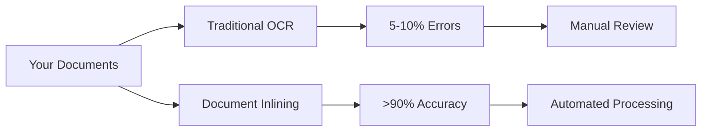

# Document Processing Demo - Banking Institution
## Addressing Your Document Processing Challenges

---

## Understanding Your Challenges

### Current Situation
- Traditional OCR with 5-10% error rate
- Manual verification creating backlogs
- 1-2 day correction cycles
- Scaling issues with increased volume
- Limited success with GPT-4 testing

### Impact on Operations
- Loan processing delays
- High manual intervention costs
- Customer experience issues
- Resource allocation challenges
- Scaling limitations

---

## Document Inlining: A Purpose-Built Solution

### Why Document Inlining?
- **Specialized for Financial Documents**: Built for banking document types
- **Dynamic Form Handling**: Optimized for varying layouts
- **Structure Preservation**: Maintains relationships in complex documents
- **Integration Ready**: Works with your existing GPT-4 pipeline

### Key Differentiators
- Purpose-built for loan processing workflows
- >90% accuracy on complex documents
- Scalable processing without quality degradation
- Cost-effective with volume increases

---

## Live Demo: Your Documents, Our Solution

### Processing Comparison


### Document Types We'll Process
- ID Cards & Passports
- Pay Stubs
- Bank Statements
- Loan Applications

---

## Technical Integration

### API Integration
```python
# Current GPT-4 Integration
response = openai.ChatCompletion.create(
    model="gpt-4-vision",
    messages=[{"role": "user", "content": [{"type": "image", "url": image_url}]}]
)

# Document Inlining Integration
response = fireworks.process_document(
    document_url=doc_url,
    transform="inline",  # Preserves document structure
    model="llama-v3p3-70b-instruct"
)
```

### Security & Compliance
- Banking-grade security
- Data privacy controls
- Audit trail capabilities
- Compliance reporting

---

## Performance Metrics

### Processing Time
- Traditional OCR + Manual: 1-2 days
- Document Inlining: Minutes

### Accuracy Comparison
- Current OCR: 90-95%
- Document Inlining: >98%

### Cost Efficiency
- Reduced manual review
- Optimized processing
- Volume-based pricing
- ROI analysis available

---

## Implementation Roadmap

### Phase 1: Pilot Program
- Test with your document types
- Integrate with existing workflow
- Measure accuracy improvements
- Calculate time/cost savings

### Phase 2: Production Migration
- Scale from sandbox to production
- Gradual rollout by document type
- Performance monitoring
- Team training and support

---

## Next Steps

### Immediate Actions
1. Technical deep-dive session
2. Pilot program setup
3. Success metrics definition
4. Timeline planning

### Support Commitment
- Dedicated implementation team
- Technical documentation
- Training resources
- 24/7 support

---

## Thank You

### Contact Information
- Technical Support: support@fireworks.ai
- Implementation Team: implementation@fireworks.ai
- Documentation: docs.fireworks.ai

*Let's transform your document processing workflow together* 